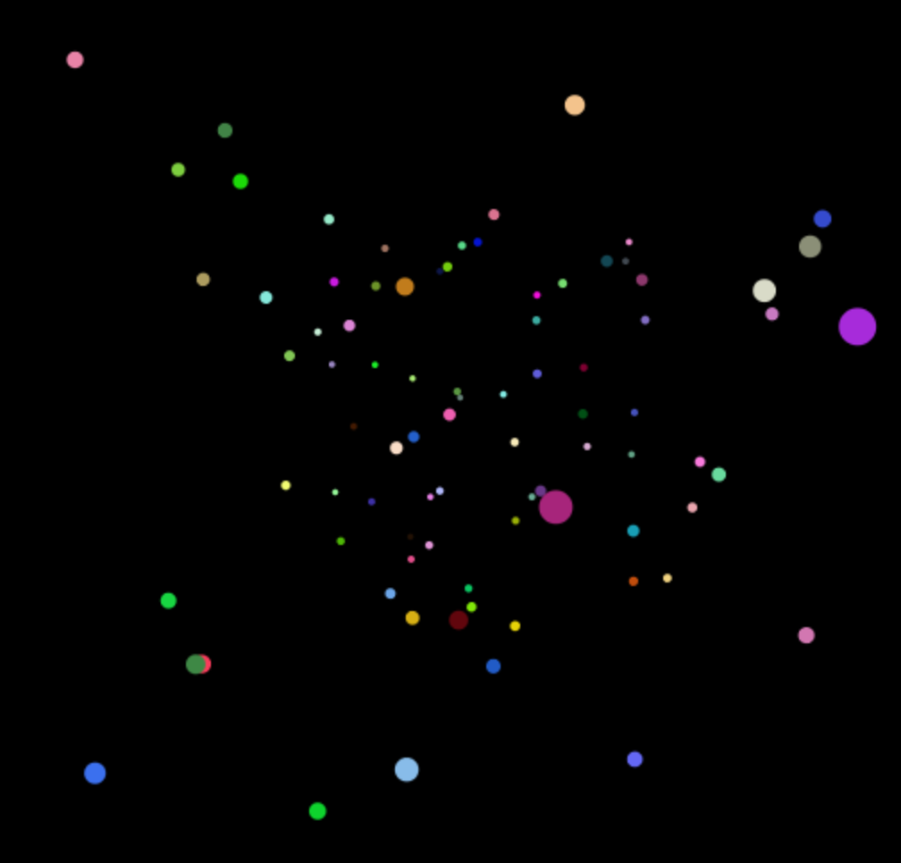

# Star Field

This is a 'star field' created with 3D computer graphics using WebGL and the Three.js library. I followed a tutroial and customised it to add colour to the stars and change their speed.

## Screenshot
<div align="center">
  
</div>

## To Run
```
$ git clone https://github.com/katebeavis/star-field-three-js.git
$ cd star-field-three-js
$ open index.html
```
Move your mouse to trigger the star field. Move your mouse around to experiment with the speed of the stars.
